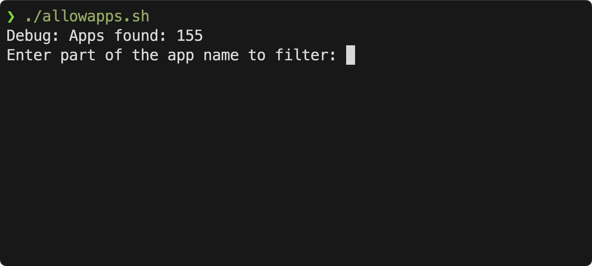
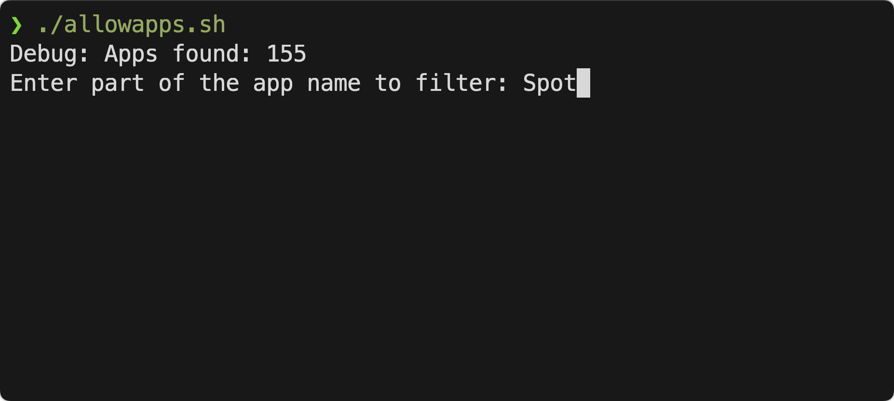
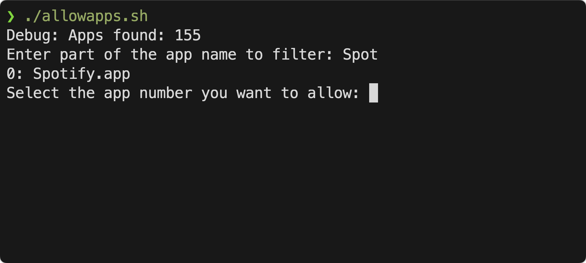
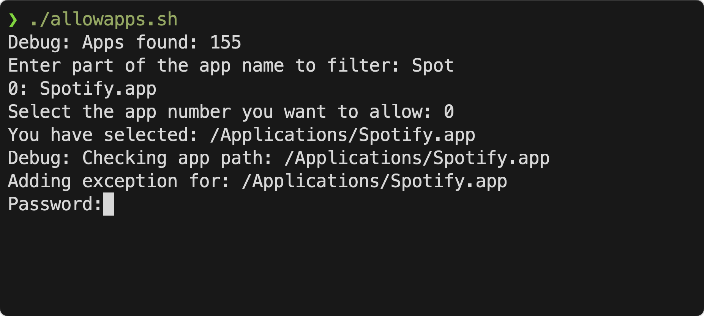
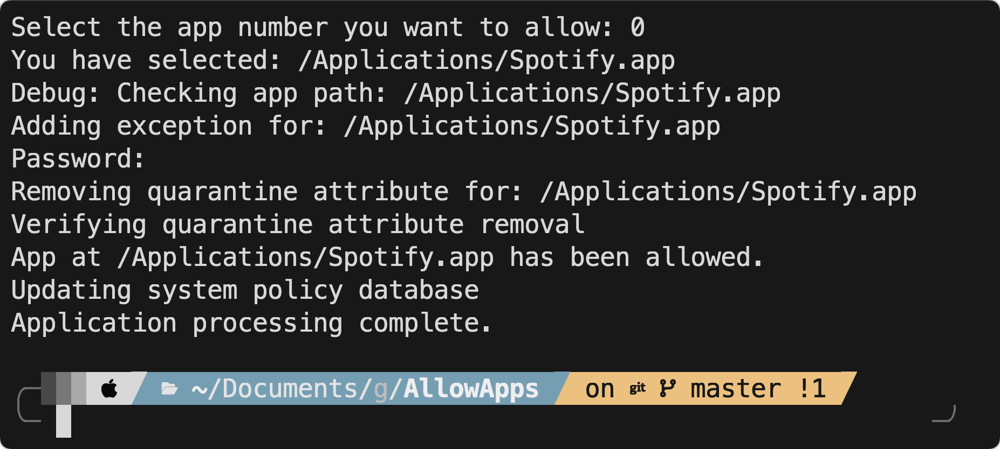

# Unidentified Applications Allow Script for macOS

## Overview

This script helps to bypass the macOS security setting that blocks applications from unidentified developers. It automates the process of adding exceptions for applications and removing their quarantine attributes, making it easier for users to open new applications without manually adjusting settings.

## Why Do You Need This Script?

macOS security settings often block applications downloaded from the internet that aren’t from identified developers. Typically, after moving the application to the Applications folder, the app needs to be manually verified in the macOS security settings, and to answer the question of **"How can I “Open an app from an unidentified developer” without using the GUI?"**

This script simplifies the process of allowing these applications by:

1. Adding the application to the security exceptions.
2. Removing quarantine attributes.
3. Updating the system policy database.

## What Does This Script Do?

-  **Lists all applications** in the `/Applications` directory.
-  **Allows you to filter and select** the app you want to authorize.
-  **Adds the selected app** to the security exceptions using the `spctl` tool.
-  **Removes the quarantine attribute** from the app using the `xattr` tool.
-  **Updates the system policy database** to reflect the changes.

## Pre-requisites

-  macOS with administrative access.
-  Terminal access. (iTerm or any Terminal Client)
-  Moving the Application **"in question"** to the `/Applications` folder

## Steps to Download and Install

1. **Clone the Repository:**
   ```sh
   git clone https://github.com/Crushoverride007/AllowApps AllowApps/

2. **Navigate to the Script Directory**
   - Change into the directory of the cloned repository:
    ```sh
    cd AllowApps/

3. **Make the Script Executable**
   - Make the script executable by running:
   ```sh
   chmod +x allowapps.sh

4. **Run the Script**
   - Execute the script with administrative privileges:
    ```sh
    sudo ./allowapps.sh
    ```
    You will be prompted to enter your password to authorize the script.

# Usage Instructions

Once the script is running, follow these steps to allow an app from an unidentified developer:



1.	Type part of the app name to filter the list of applications. For example, typing Spot... might filter to display applications like Spotify.



2.	Select the application by entering the corresponding number from the filtered list.







3.	The script will then:
     -  Add the app to the security exception list.
     -  Remove the quarantine attribute.
     -  Update the system policy database.
	
4.	Verify that the application can now be opened without macOS security warnings.

# Contributing

Feel free to submit issues, fork the repository, and send pull requests. For major changes, please open an issue first to discuss what you would like to change.